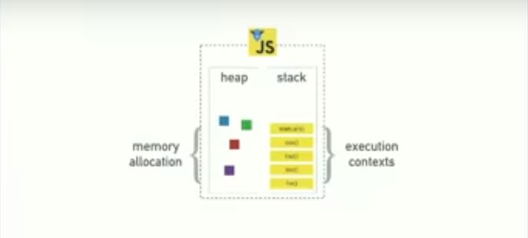
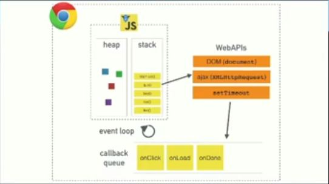
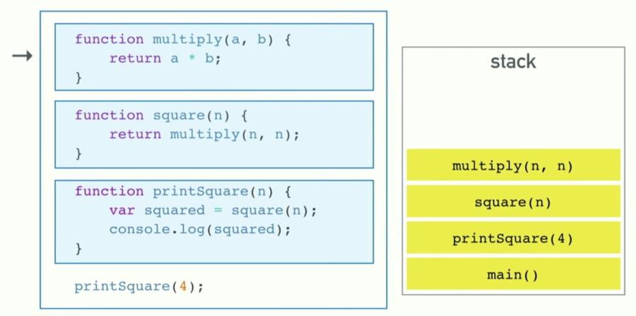
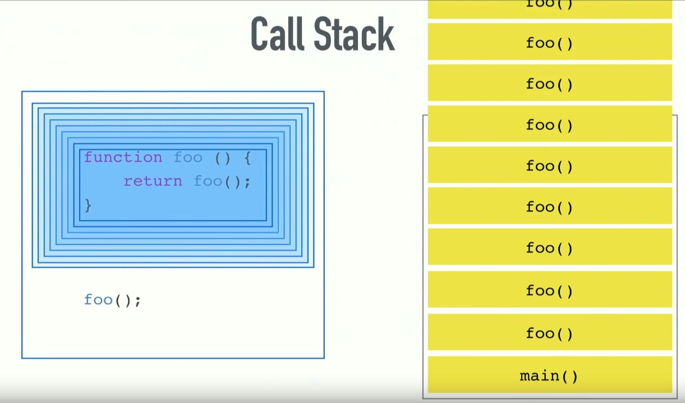
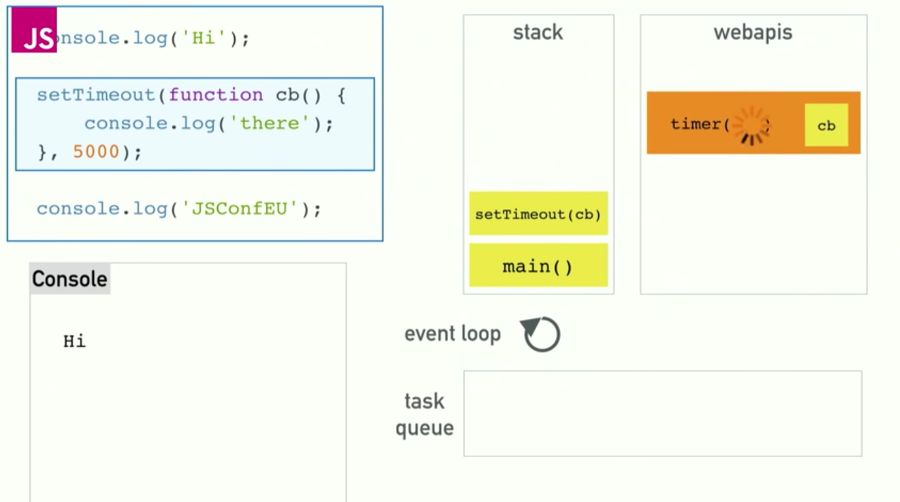

# 자바스크립트는 어떻게 작동할까?
자바스크립트는 어떻게 작동할까요? 여타 다른 언어들과 마찬가지로 컴파일되고, 랜더링과정을 거칠까요? 지금부터 자바스크립트가 어떻게 작동하는지에 대해 알아보겠습니다.   

자바스크립트가 어떻게 작동하는지 구글을 통해 여러 문서를 찾아보고, 레포를 많이 보았지만 쉽고 간단하게 설명된 문서가 없었습니다. 그러다가 외국의 한 컨퍼런스 영상을 보고 비동기 방식의 동작원리에 대해 조금은 이해를 할 수 있었습니다.

문서 출처 : https://www.youtube.com/watch?v=8aGhZQkoFbQ

자바스크립트에서 함수를 실행 시키면 함수가 call Stack에 쌓이며 LIFO(Last In First Out)방식으로, 나중에 들어온 함수부터 처리를 합니다. 이는 자바스크립트 뿐만 아니라 다른 타 언어들에서도 많이 볼 수 있습니다.

하지만 자바스크립트는 조금 특별한 점이 있습니다. 싱글 스레드 형태이지만, 콜백을 사용합니다. 자바스크립트는 싱글 스레드 논 블록킹 비동기 동적 언어입니다. 그렇기 때문에 콜스택과 이벤트 루프, 콜백큐, API등을 갖고 있습니다.

위의 사진은 실제 자바스크립트의 런타임을 단순화한 사진입니다.
메모리 할당이 일어나는 힙과 콜 스택이 있는데요, 크롬의 V8 프로젝트를 클로닝해서 코드 베이스를 들여다 보면 setTimeout함수나, DOM, HTTP 요청을 관리하는 코드들은 찾아볼 수 없습니다. 방금 예시로 든 것들은 비동기 코딩하면 먼저 떠오르는 것 들인데요, 처음에 공부를 하면서 코드가 없다는 사실이 놀라웠습니다.

'Philip Roberts'는 문서의 영상을 찍으신 분 입니다. 이분이 웹 상의 런타임과 비동기 코드들을 찾아서 합친 사진이 있는데요, 이 사진을 이용해서 설명해 드리겠습니다. (사랑합니다)

이 사진에는 V8런타임과 브라우저가 제공하는 웹 API가 있습니다. 브라우저는 DOM, AJAX, timeout 등과 함께 event loop와 콜백 큐를 포함함을 알려줍니다. 하지만 이것들이 어떤식으로 연결되어서 움직이는지 정확하게 이해하시는 분들은 많지 않을 것 입니다.

아까전에 적은 것 처럼 자바스크립트는 싱글 스레드 프로그래밍 언어입니다. 그렇기에 한번에 하나의 싱글 콜 스택만을 가질 수 있습니다. 쉽게 말하면 하나의 프로그램은 동시에 하나의 코드만 실행할 수 있다는 것 입니다.

Stack영역에 함수들이 하나씩 차례대로 들어가는 모습을 보여주는 사진입니다. Call Stack은 데이터 스트럭처로 실행되는 순서를 기억합니다. 함수를 실행하려면 스택에 해당되는 함수를 집어넣게 되는데, 함수에서 리턴이 일어나면 먼저 스택의 가장 위쪽에서 해당 함수를 꺼내게 됩니다. 이게 Call Stact이 하는 일의 전부입니다.

 main()함수가 실행이 되고, 코드의 아래부분에서 `printSquare(4);`를 실행하였기 때문에 Stack에는 매개변수가 4인 Square()함수가 들어가게 됩니다. 이후로 차례대로 실행된 square()함수와, multiply()함수가 들어갑니다. 이것이 싱글 스레드로 이루어지기 때문에 하나하나 들어가고 Stack을 빠져나갈 때도 하나씩 나가게 됩니다.

 그런데 만약 함수가 무한 실행이 된다면 어떻게 될까요?

위 사진은 Call Stack에서 무한반복하는 함수가 생겨서 오버플로우가 생기는 사진입니다. 사진의 foo()함수는 foo()함수를 반환합니다. 이렇기 때문에 반환을 무한 반복하게 됩니다. 이렇게 되면 Stack에는 foo()함수가 계속 쌓이게 되고, 크롬의 한계치인 16000을 넘게 함수를 호출하게되면 크롬에서 자체적으로 실행하는 것을 막고, 버그를 수정할 것을 console을 통해 요청해 줍니다. 여기서 반복적인 함수가 생기니 브라우저는 느려질 수 밖에 없습니다. 왜 그럴까요?

### 느려짐
웹 브라우저에서 느려짐을 블로킹 혹은 블로킹 현상이라고 흔히 말합니다. 하지만 블로킹이라는 것은 정확한 것이 아닙니다. 그저 느리게 동작하는 코드가 Stack에 남아있을 때를 말하는 것 입니다. 그렇다면 우리가 흔히 말하는 '느려짐'이란 무엇일까요?

먼저 웹 브라우저가 느려지는 이유는 `웹 브라우저에서 코드가 실행되고 있기 때문`이라고 설명할 수 있습니다. 예를 들어 순차적으로 서버에서 데이터를 불러와서 실행시키는 함수가 3개있다고 한다면, 3개의 함수가 차례대로 들어가고 빠지고를 반복하는 동안에는 브라우저는 작동하지 않습니다. 말 그대로 먹통 상태가 되고맙니다. 멈처있는 동안에 했던 행동들은 웹 브라우저의 리퀘스트가 끝나고나서 모두 실행이 됩니다. 이러한 결과는 큰 문제점을 재기할 수 있습니다. 그렇다면 어떻게 해결해야 할까요? 정답은 `비동기 콜백`입니다.

### 비동기 콜백
비동기 콜백이란 어떤 코드를 실행하면 결국 콜백을 받고 이걸 나중에 실행한다는 말 입니다. 아참, 비동기 콜백을 설명하기 전에 JavaScript를 잠깐 설명하도록 하겠습니다. 자바스크립트에는 setTimeout이라고 하는 시간에 따라서 실행을 하도록 하는 함수가 구현되어있습니다. setTimeout은 1개의 콜백함수와 1개의 숫자를 인자로 받는데, 입력한 숫자만큼의 시간이 지났을 때 콜백 함수가 동작하게 되는 원리입니다. 이 함수가 대표적인 비동기 콜백이라고 할 수 있습니다.

이 사진은 setTimeout()함수의 동작 원리를 나타낸 사진인데요, setTimeout을 사용하여 console.log 로 hi 를 출력하도록 하면 console.log 는 큐에 등록되고, JSConf를 먼저 출력합니다. 이후 5초 뒤에 there을 찍게 됩니다. (인자값 5000은 5초 입니다.) 

이것을 글로 설명하자니 복잡하네요. 먼저 Stack에 `console.log('hi')`가 올라옵니다. 다음으로 'hi'문자열이 스택을 빠져나가고, `setTimeout`함수가 Stack에 올라갔다가 console.log를 찍지 않고 탈출을 하게됩니다. 이후에 `console.log(JSConFEU)`가 Stack에 들어갔다가 나가고, 5초뒤 setTimeout함수의 `console.log('there')`이 Stack에 추가가 됩니다. 

여기서 이벤트 루프와 '동시성'이 역할을 맡게 됩니다. 앞서 자바스크립트는 싱글스래드이기 때문에 하나의 일만 처리할 수 있다고 말 했었는데요, 이것은 사실입니다. 자바스크립트는 다른 코드를 실행하는동안 서버와 통신하는 Ajax요청을 실행할 수 없습니다. setTimeout()함수또한 마찬가지 입니다. 하지만 이것이 동시에 수행할 수 있는 이유는 브라우저는 단순 런타임 이상을 의미하기 때문입니다. Web브라우저가 자바스크립트의 스레드를 적극 지원하기 때문에 여기서 동시성이 들어가는 것 입니다. 

다시 사진으로 가서 사진의 우측에 있는 webapis에는 현재 setTimeout의 타이머 5초와 콜백함수가 작동하고 있습니다. 5초가 지나면 콜백함수(cb)가 task queue로 이동하면서 타이머가 끝이납니다. 이후 이벤트 루프가 작동합니다. 이벤트 루프는 전체 시스템에서 아주 단순한 일을 하는 작은 파트입니다. 이벤트 루프는 콜 스택과 테스트큐를 주시하면서 스택이 비어있으면 테스트 큐에존재하는 콜백을 스택으로 넘겨줍니다. 
그렇기 때문에 효율적인 브라우저 운영이 가능한 것 입니다. 이것이 JavaScript에서 비동기 함수가 동작하는 방법입니다. 

이것을 이용해서 알수없는 문제를 해결 할 수도 있습니다. 
setTimeout()함수에 인자값을 0을 넣어주고 실행을 시키면 setTimeout()함수는 스택이 비어있을 때 실행을 하기때문에 0초뒤에 실행을 시킨다면 무슨 오류가 발생했는지, 문제가 무엇인지 파악할 수 있을 것 입니다.

## 브라우저
브라우저는 기본적으로 화면을 매 16.6밀리세컨드, 즉 1초에 60프레임을 repaint하는게 가장 이상적입니다. 이것이 가장 빠른 속도입니다. 하지만 브라우저는 자바스크립트의 동작들 덕분에 느려질 수 밖에 없습니다. 스택에 코드가 있다면 렌더링도 하나의 콜백처럼 행동하기 때문에 렌더링을 하지 못합니다. 때문에 스택이 비워질 때 까지 기다려야 합니다. 그렇지만 렌더는 우리의 콜백보다 우선순위가 빠르기 때문에 16밀리세컨드마다 큐에 렌더가 들어가고 스택이 빈 후 렌더링을 시작합니다. 

사람들이 event loop를 막지 마라고 하는 경우가 있습니다. 이런 경우는 '브라우저가 할일을 못하게 만들지 말아라, 유동적인 UI를 만들어라.' 라는 의미 입니다. 

지금까지 JavaScript의 작동원리에 대해 설명해드렸습니다. 공부하면서도 어려운 개념들이 중간중간 섞여있어서 어려웠습니다. 만약 이해가 안가시는 분들은 운영체제나, 컴퓨터구조 등을 공부해 보시기 바랍니다.