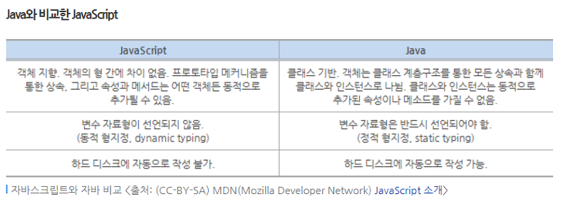

# 자바스크립트 란?
## 무엇?!
 자바스크립트는 객체기반의 스크립트 프로그래밍 언어입니다. 1995년 12월 4일에 브렌던 아이크라는 설계자의 설계하에 넷스케이프, 모질라 재단, Ecma 인터네셔널 등 여러 곳에서의 개발로 인해 만들어졌습니다. 대부분 웹 브라우저에서 사용하며 다른 응용프로그램의 내장 객체에도 접근할 수 있습니다. 처음에는 `모카`라는 이름으로 만들어진 언어였습니다. 이후 `라이브스크립트`라는 이름으로 변경된 후 최종적으로 `자바스크립트`라고 하는 어썸한 이름을 얻은 언어이죠. C언어의 기본 구문에 바탕을 두었고 자바스크립트와 함께 자주 쓰이는 용어인 `DOM`은 사실 ECMA스크립트표준의 일부가 아닙니다. DOM은 자체로 하나의 표준이며 XML에 기반을 둡니다. 

 또한 자바스크립트와 자바가 이름이 비슷하다는 이유로 둘을 혼동하시는 경우가 있습니다. 하지만 둘은 정말 닮다의 'ㄷ' 자도 해당되지 않는 경우입니다. 둘을 비교해보면 자바스크립트는 객체지향언어입니다. 물론 자바또한 객체를 사용하긴하지만 클래스 기반언어라고 보는 것이 합당할 것 같습니다. 또 자바스크립트는 변수자료형을 선언하지 않는 면에 비해 자바는 각각의 변수 자료형이 존재합니다. 둘의 차이점을 표로 나타내면 다음과 같습니다.
 
   

## 구원자
 과거 2000년대 초반에 웹이라는 시장이 활성화되면서 javascript는 웹과 함께하였습니다. 웹페이지에서 눈이 날라다니거나 비가오거나, 오른쪽 클릭을 금지하거나, 천천히 나오는 애니메이션등과 같은 여러 효과를 나타나게 해주었죠. javascript가 웹페이지에서 간단하게 사용될 때에는 그리 유명하지 않았습니다. 또한 javascript를 사용할 수 있는 사람들의 평가또한 높지 않았습니다. 그러나 웹과 모바일 스마트폰 시장이 발전하고, 점점 중요도가 올라가면서 웹페이지의 화려한 애니메이션, 보안, 서버, 데이터 저장등과 같은 영역에 JavaScript가 사용되고 있습니다.

## 싸가지없는 언어
과거에 javascript가 대우받지 못하고, 무시당한 이유가 무엇일까요? 지금은 스크립트 형식의 언어들 즉, 뭔가 엄청나게 유연한 방식의 언어들을 선호하고 있는 추세입니다. 하지만 과거에는 javascript와 같은 자유로운 언어는 전통이 없는 것처럼 분류되었고, C언어나 C++, JAVA등과 같은 언어들이 가지고 있는 딱딱함이나, 객체단위를 지향하는 언어들이 개념있고, 좋은 언어 취급을 받았습니다. 지금까지 설명드린 것 처럼 자바스크립트는 정리가 되지 않은 문서(?)같은 느낌을 주던 언어였습니다. ( 너무 유연하게 작동하고 동작해서 유지보수가 힘들고, 오류수정하기가 까다로웠던 이유도 있습니다. )  
모바일이 등장하기 전에는 사용자의 유구사항이나 목적에 맞쳐서 코딩을 완료하면 되기 때문에 딱딱한 객체지향설계를 이용했습니다. 하지만 모바일 기기의 등장 이후 모바일 시장이 성장하면서 기술의 발전과 요구사항을 바로 반영할 수 없는 상황이 오면서 객체지향적 설계의 한계에 다다르게 됩니다. 이후 Python, Ruby, Scala, Swift 등과 같은 유연한 언어들이 여럿등장하면서 JavaScript가 유명새를 타기 시작합니다. 이러한 언어들은 사용자, 기획자의 요구사항을 바로바로 반영하고, 설계의 구조를 변경하는 것이 유연하다는 점 입니다. 또한 다른 언어들에 비해서 제약이 많이 없습니다. 

## 자바스크립트의 역할
JavaScript의 일반적인 용도는 웹 페이지에 기능을 더해 HTML 웹 페이지를 동적으로 움직이게 만드는 것 입니다. 자바스크립트의 역할은 수도 없이 많지만 몇개만 뽑아본다면  
1. HTML 페이지 변경 몇 HTML 엘리먼트와 콘텐츠의 추가나 제거
2. CSS 및 HTML 엘리먼트의 스타일 변경
3. 사용자와의 상호작용, 폼의 유효성 검증
4. 마우스와 키보드 이벤트에 대한 스크립트 실행
5. 웹 브라우저 제어, 쿠키 등의 설정과 조회
6. AJAX 및 AXIOS 기술을 이용한 웹 서버와의 통신
7. 동적인 효과 이미지 롤오버 상태표시줄에 문자열표시 등..
8. 웹 사이트의 기능적인 면 쿠키처리, 새로운 WINDOW열기 등..

이렇듯 요즘 시대에는 자바스크립트가 많이 발전되서 JSP나 PHP같은 어려운(?) 언어 없이 HTML과 JS만으로 이루어진 웹 사이트가 많이 등장했습니다.

지금까지 자바스크립트는 무엇일까? 라는 제목으로 글을 적었는데요, 현재에는 정말 유용하고 깔끔한 언어로 분류되고 있습니다. 모두 자바스크립트를 사랑합시다!