# 프로미스(Promise)

자바스크립트에서는 대부분의 상황에서 작업들이 비동기적으로 이루어집니다. 어떤 작업을 요청하면서 콜백 함수를 등록하면, 작업이 수행되고 난 후 결과를 나중에 콜백을 통해 알려주는 식 입니다. 실제 비동기 작업이 아니더라도 자바스크립트의 세계에서는 콜백을 통해 결과를 알려주는 패턴이 매우 흔하게 발생합니다.

초기의 자바스크립트는 이벤트가 발생했을때 콜백 함수를 호출하는 정도의 수준 이었기 때문에 복잡도가 높지 않았지만 최근에는 프론트엔드의 비중이 높아졌기 때문에 자바스크립트로 작성하는 코드를 바라만 볼 수 없어졌습니다. 

이렇게 복잡도가 높아지는 경우에서 특히 어려워지는 케이스는 콜백의 중첩입니다. 하나의 작업을 콜백을 통해 결과를 받은 뒤 순차적으로 다음 작업을 진행하고자 할 때 이러한 콜백 중첩, 흔히말해서 콜백지옥을 맛보게 됩니다.

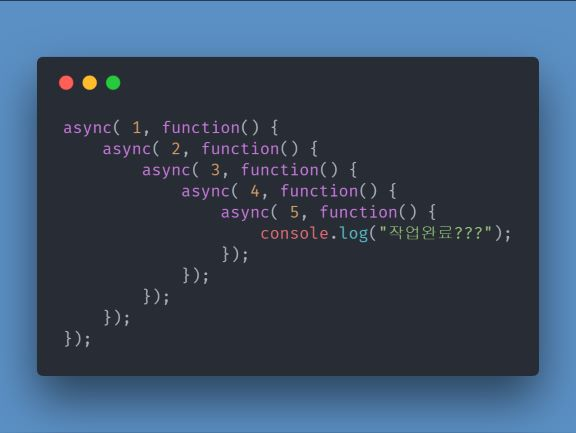

이런 상황을 극복하기 위해 오래전부터 promise라는 패턴이 제안되어 왔습니다. jQuery에서는 Deferred라는 이름으로 완전하지는 않지만 Promise패턴이 사용되었고, 그 외에도 여러 라이브러리를 통해 Promise패턴을 구현해서 콜백 중첩으로 인한 어려움을 해소했습니다.

Promise 패턴을 사용하면 코드의 가독성이 확연하게 증가하고, 비동기 작업들을 순차적으로 진행하거나, 병렬로 진행하는 등의 컨트롤이 수월해 지기 때문에 콜백의 중첩을 줄일 수 있습니다. 또 내부적으로 예외 처리에 대한 구조가 단단해 지기 때문에 오류가 발생했을때 오류 처리에 대해 보다 가시적으로 관리할 수 있다는 장점이 있습니다.

현재 Promise 패턴은 ECMAscript6 스펙에 정식으로 포함되어 있고, 2013년 12월 경 Chrome 브라우저에서도 32버전부터 native promise가 지원되기 시작했다. Node.js의 경우 0.11.3 버전 이후로 부터 native promise를 지원합니다.

Chrome 자체에 내장되어 있는 ES6 표준 Promise에 대해 하나하나 뜯어보면서 Promise를 파해쳐 보겠습니다.

## Promise 기초

아래의 코드를 크롬 콘솔에서 타이핑 해보세요.

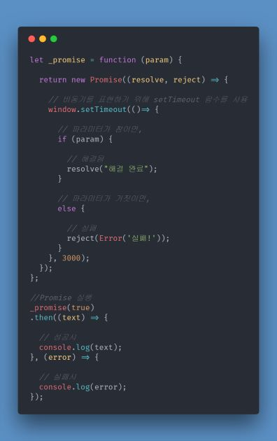

실행 결과 콘솔창에 '해결완료'가 나오는 것을 확인할 수 있습니다. 

몇 줄 안되는 코드지만 프로미스의 기초를 다지기에는 정말 좋은 코드입니다.  
위의 코드는  Promise 선언과 실행으로 나눌 수 있습니다. 하나씩 살펴보겠습니다.

## Promise 선언부
Promise는 말 그대로 **'약속'** 입니다. **'지금은 없으니까 나중에 줄게~'** 라고 하는 약속입니다. 더 정확히는 **'지금은 없는데 이상이 없으면 이따가 주고 없으면 알려줄게~'** 라는 약속입니다. 

따라서 Promise는 다음 중 하나의 상태(state)에 속하게됩니다.

    pending
    아직 약속을 수행 중인 상태 이다.(fulfilled 혹은 reject가 되기 전)

    fulfilled
    약속(promise)이 지켜진 상태.

    rejected
    약속(promise)이 어떤 이유에서 못 지켜진 상태

    settled
    약속이 지켜졌든 안지켜졌든 일단 결론이 난 상태

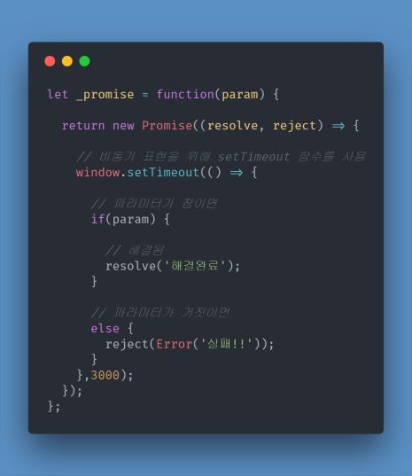

위의 promise 선언부를 보면, 나중에 Promise 객체를 생성하기 위해 Promise 객체를 리턴 하도록 함수로 감싸고 있습니다.

Promise 객체만 보면 파라메터로 익명함수를 담고 있고, 익명 함수는 resolve와 reject를 파라메터로 받고 있습니다.

일단 new Promise로 Promise가 생성되는 직후부터 resolve나 reject가 호출되기 전까지의 순간을 `pending`상태라고 볼 수 있습니다.

이후 비동기 작업이 마친뒤 결과물을 약속대로 잘 줄 수 있다면 첫번째 파라메터로 주입되는 resolve함수를 호출하고, 실패했다면 두 번째 파라메터로 주입되는 reject 함수를 호출한다는 것이 promise의 주요 개념입니다.

위의 예제에서는 비동기 작업을 시뮬레이션하기 위해 setTimeout 함수를 사용했습니다.

## Promis 실행부

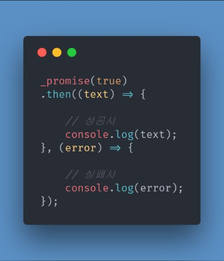

실행하는 부분은 더욱 심플하다. _promise()를 호출하면 Promise 객체가 리턴된다.  
Promise 객체에는 정상적으로 비동기작업이 완료되었을 때 호출하는 then이라는 API가 존재한다. 위의 예제는 **하나의 then API**를 호출해서 비동기 작업이 완료되면 결과에 따라 성공 혹은 실패 메시지를 콘솔로그로 찍어주게 된다.

## 에러를 잡는 Promise.catch API

만약 체이닝형태로 연결된 상태에서 비동기 작업이 중간에 에러가 나면 어떻게 처리해야할까요? 그때를 위해 존재하는 API가 catch API입니다. .then(null, functiom(){}) 을 메서드 형태로 바꾼 거라고 생각해도 좋습니다.

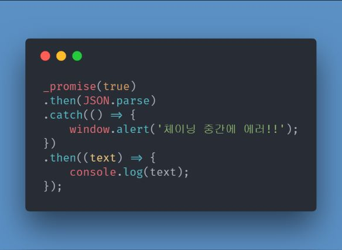

앞서 _promise 에서 만든 객체는 성공 혹은 실패시 JSON객체가 아닌 String 객체가 아닌 String을 리턴하므로 JSON.parse에서 오류가 나게 됩니다. 따라서 .than으로 이동하지 않고, .catch로 이동하게 됩니다. catch는 이와 같이 promise가 연결되어 있을때 발생하는 오류를 처리해주는 역할을 합니다.

아래의 예제는 HTML5Rocks 에서 보이고 있는 예제입니다.

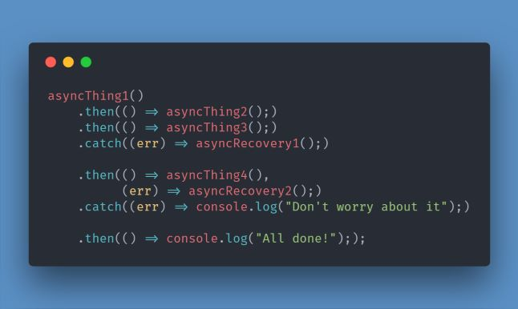

위의 그림을 해석해보면 다음과 같이 나열할 수 있습니다.

- 성공시  
  1. asyncThing1성공 -> asyncThing2로
  2. asyncThing2성공 -> asyncThing3로
  3. asyncThing3성공 -> asyncThing4로
  4. asyncThing4성공 -> All done!

- 실패시
  1. asyncThing1실패 -> asyncRecovery1로
  2. asyncRecovery1실패 -> asyncRecovery2로
  3. asyncRecovery2실패 -> Don't worry about it
  4. 실패 -> 에러

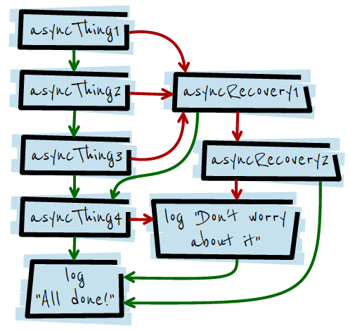  
**출처 : https://programmingsummaries.tistory.com/325**

## 여러 프로미스가 완료될 때 실행하기 위해선? - Promise.all API

여러개의 비동기 작업들이 존재하고 이들이 모두 완료되었을 때 작업을 진행하고 싶다면, Promise.all API를 활용하면 됩니다.

아래의 코드를 살펴봅시다.

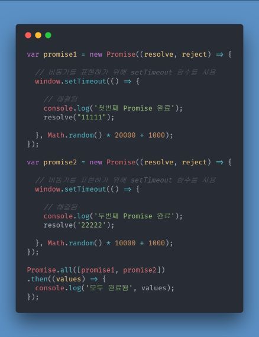

두 번째 Promise가 완료된 뒤, 시간이 흘러 첫 번째 Promise가 완료되면 최종적으로 전체 값을 보여줍니다.

```javascript
Promise.all([promise1, promise2])
.then((values) => {
  console.log('모두 완료됨', values);
});
```
에서 values는 배열타입으로 promise의 resolve값을 의미합니다.

## return 하지 않고 바로 new Promise로 생성하기

항상 new Promise를 return 하는 형태로 사용하다가 바로 위의 Promise.all에 대한 설명할 때는 return이 아닌 바로 new Promise를 할당하는 형태로 사용했습니다. 어떤 차이가 있을까요?

아래의 코드를 실행했을 때 어떻게 될지 예측해봅시다.

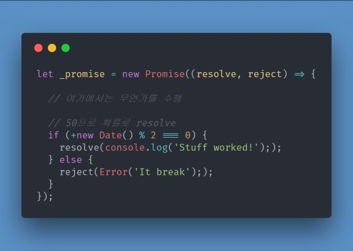

위와 같이 실행할 경우 Promise 객체에 파라메터로 넘겨준 익명함수는 즉각 실행됩니다.  
그렇기 때문에 _promise.then(alert) 등의 형태로 사용할 수 있습니다.

이후 여러차례 _promise.then(alert)를 호출해도 이미 한번 수행 되었기 때문에 계속해서 resolve 혹은 reject가 수행될 것 입니다.

테스트 삼아서 _promise.then(alert).catch(alert); 를 여러차례 수행해보세요.

한번 'Stuff worked!' 가 나왔다면, 몇 번을 반복해서 수행해도 계속 'Stuff worked!'가 나오게 됩니다.

Promise 객체를 new로 바꾼 다음 바로 생성할 경우, 아래와 같은 형태로도 사용가능 할 것 입니다.

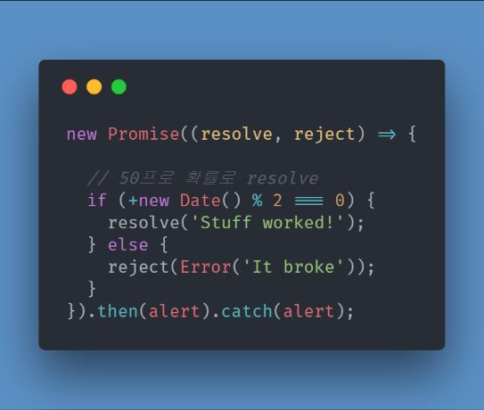

위의 코드에서 Date()

이번에는 앞서 Promise.all에 대한 예제를 Promise를 return 하는 형태로 바꿀경우 어떻게 변하는지 알아보겠습니다.

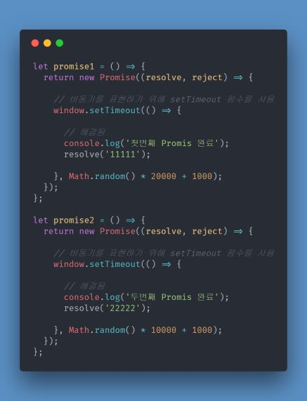

위와 같이 Promise 객체를 return 하는 형태로 바꿀 경우 위에서처럼

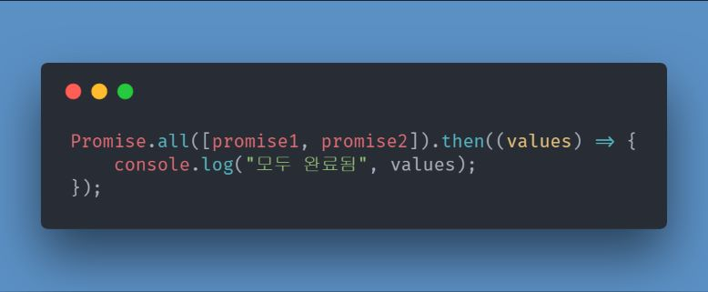

와 같은 형태로는 Promise.all API를 사용할 수 없습니다. Promise 객체가 아니기 때문에 오류 메시지를 만나게 됩니다.

따라서 아래와 같이 실행해야 정상적으로 Promise.all API를 호출할 수 있습니다.

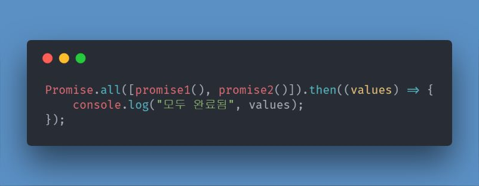

## 결론

지금까지 크롬에 포함된 Promise를 기반으로 비동기 로직을 처리하는 방법에 대해서 살펴보았습니다. 크롬에 내장된 Promise보다 강력한 기능을 담고 있는 Promise 라이브러리들이 많이 존재합니다. 그 중에서도 bluebird 라는 라이브러리가 기능과 성능면에서 주목받고 있습니다.

http://bluebirdjs.com/docs/benchmarks.html

Promise는 크롬에 기본 내장된 만큼 향후 V8엔진을 사용하는 노드에도 기본 지원될 확률이 높습니다. 비동기 로직이 불가피한 자바스크립트 코딩에서 효율적으로 비동기 로직을 처리할 수 있는 Promise를 손에 익혀둔다면 좀더 가독성있는 코드를 만드는데 도움이 될 수 있을 것 입니다.