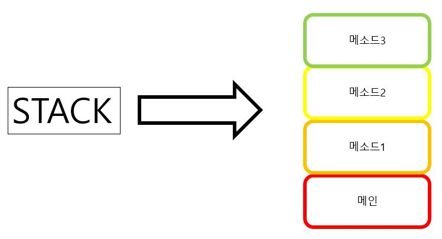

# This

자바스크립트의 This는 다른 언어와 매우매우 다릅니다. 지금까지 다른 언어를 공부해보신 분들도 있을 것 이고, OOP언어를 접해보신 분들도 계실겁니다. 하지만 모두들 자바스크립트의 this에 대하여 감을 잡기 쉽지 않을 것 이라고 예상됩니다.

자바스크립트에서 this를 이해하기 위해서는 call Stack과 call Site를 이해해야합니다.

## Call Stack
`Call Stack`은 함수가 Stack에 쌓이고, 호출 되는 스택을 말합니다. 이때 스택은 흔히 자료구조에서 말하는 스택을 말하는 것 입니다. 만약 `Javascript_ALL`의 [자바스크립트의 작동원리](https://github.com/junu126/JavaScript_All/blob/master/Base-Class/How-Does-JavaScript-Work.md)를 읽어 보셨다면 충분히 이해 가리라고 생각합니다.


이 그림은 자바스크립트의 Call Stact 동작을 나타내고 있는 사진입니다.  
Main 함수를 기준으로, 메소드1이 호출되고, 메소드1 함수 내에서 메소드2 함수가 호출되고... 이 행동을 반복하여 마지막 메소드 까지 호출해 냅니다.  
메소드3 함수의 실행이 종료되고, 값을 반환해 메소드2로 돌아가기위한 주소를 저장해둔 CALL STACK을 확인하고, 메소드2로 돌아가서 메소드2의 역할을 실행 한 후 다시 한번 값을 반환하고.. 이 행동을 반복하여 Main 함수로 돌아오게 됩니다.

지금까지는 자바스크립트의 동작 과정이고, 다음은 브라우저에서의 동작 과정을 살펴보도록 하겠습니다.

## 브라우저의 JavaScript
브라우저에는 `Window`하는 Window객체가 존재합니다.  

JavaScript는 모든 것을 객체로 다루기에 여기서 window객체는 oop의 객체가 아니라 자바스크립트의 Object타입 ( key-value 쌍을 갖는 )으로 데이터 타입입니다.  

Window객체에서도 함수와 변수가 잘 정의되고, 실행됩니다. 브라우저 내에서 동작하는 JavaScript의 경우에는 결국에는 Window객체 아래에 존재하는 것 입니다.

즉, Main함수의 역할을 하는 것이 Window 객체라고 볼 수 있습니다.

## Node.JS에서의 JavaScript
Node.js의 런타임에서는 마찬가지로 global 이라는 객체가 존재합니다.

브라우저와 마찬가지로, Nodw에서는 global 객체가 Main함수의 역할을 하게 됩니다.

지금까지 여러 환경에서 JavaScript의 Stack 환경을 살펴보았습니다. 읽으면서 보셨듯이, JavaScript는 자꾸 객체를 다룹니다. 만약 함수가 호출이 되면, 호출된 함수가 포함된 객체가 있을 것 입니다. 대게는 그 객체가 전역 변수이므로 이경우 `this`는 그 전역 변수가 되게 되는 것 입니다. 브라우저의 경우에는 `window`가, node의 경우에는 `global`이 되는 것 입니다.

## Call Site
Call Site는 **함수가 호출 된 지점**을 말합니다. 아까 언급한 것 처럼 JavaScript에서는 함수가 호출되는 지점에서의 포함된 객체를 찾아 해당 객체와 `this`를 바인딩합니다.

### 예제 1
```javascript
var object1 = {
  grade: 'your first grade',
  mtd: () => {
    console.log(this.grade);
  },
};

var object2 = {
  grade: 'your second grade',
  mtd: object1.mtd,
};

console.log(object2.mtd());   // 'your second grade'를 출력.
```

### 예제 2
```javascript
var grade = 'Real Grade!';

var obj = {
  grade: 'your first grade',
  mtd: () => {
    console.log(this.grade);
  },
};

var mtd = obj.mtd;

console.log(mtd());   // 'Real Grade!'를 출력
```

### 예제 3
```javascript
func1 = () => {
  console.log(this.grade);
}

func2 = (fn) => {
  fn();
}

var obj = {
  grade: 'your grade from obj',
  mtd: func1,
};

var grade = 'Real Grade!';

func2(obj.mtd);   // 'Real Grade!'를 출력
```

## *bind* 메서드
`bind` 메서드는 `this`를 강제로 `bind`메서드를 호출한 함수로 바인딩 시킨 후 새로운 함수를 반환하는 메서드 입니다.

`bind` 메서드의 원형은 `Function.prototype.bind` 이므로, 모든 함수는 이를 호출할 수 있습니다.

### 예시
```javascript
speakNation = () => {
  console.log(this.nation);
}

var person = {
  name: 'Hong Kil Dong',
  nation: '한국'
}

var hongSpeakNation = speakNation.bind(person);

hongSpeakNation();
```

## *apply* 메서드
`apply` 메서드는 `bind`메서드와 유사한 일을 진행합니다. 하지만 차이점이 있다고 하면 새로운 함수를 반환하는 것이 아니라 바로 해당 함수를 호출하는 점 입니다.

`apply` 메서드의 원형은 `Function.prototype.apply` 이므로, 모든 함수는 이를 호출할 수 있습니다.

### 예시
```javascript
speakNation = () => {
  console.log(this.nation);
}

var person = {
  name: 'Hong Kil Dong',
  nation: '한국'
}

speakNation.apply(person);
```

## *call* 메서드

`call`메서드는 `apply`와 딱 한가지 차이점을 빼 놓고 완전히 동일합니다.

`call`메서드는 여러 개의 파라미터를 받는 반면, `apply`는 하나의 파라미터 리스트를 받습니다.

`call`메서드의 원형은 `Function.prototype.call` 이므로, 모든 함수는 이를 호출할 수 있습니다.

지금까지 `this` 키워드에 대해 설명 드렸습니다. this 키워드는 직접 사용해보며, 익히는게 가장 좋을 듯 합니다.

* kesuskim님의 블로그를 참고하여 글을 작성했습니다.
(https://blog.kesuskim.com/2016/09/understanding-js-this/)