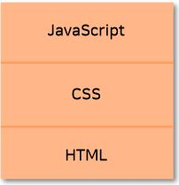
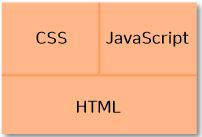

# UI 레이어 느슨하게 연결하기.

웹 개발에서 사용자 인터페이스(UI)는 총 세 개의 레이어로 나뉘고 서로 유기적으로 작동합니다.
- **HTML은 페이지에서 데이터와 의미를 정의하는 데 사용합니다**
- **CSS는 페이지의 스타일을 꾸미는 데 사용합니다.**
- **자바스크립트는 페이지에 동작을 부여하는 데 사용합니다.**

UI 레이어는 다음 그림처럼 HTML이 기본이 되고 CSS와 자바스크립트 레이어가 그 위에 있습니다.  



그림에서는 CSS 위에 자바스크립트가 있지만 실제로는 자바스크립트가 CSS에 의존한다기 보단 서로 형제같은 관계입니다. 자바스크립트 없이 HTML과 CSS만으로 페이지를 만들 수 있고, 그 반대로 CSS 없이 자바스크립트와 HTML만으로도 페이지를 만들 수 있습니다. 세 레이어의 관계는 다음 그림과 같습니다.

전체 UI에서 CSS와 자바스크립트가 같은 위치에 있다고 생각해야 이 둘의 의존성을 줄이는 데 더 도움이 됩니다. 예를 들어 자바스크립트는 CSS와 상호작용 관계에 있을지라도 CSS에 의존하지 않고 독립적으로 동작해야 합니다.



웹 UI에서 각 레이어는 우리가 관리하는 커다란 시스템 중 한 부분입니다. 그런데 HTML, CSS, 자바스크립트 간 결합도가 높아 한 레이어를 조금만 변경해도 다른 레이어까지 변경해야 하는 경우가 많습니다. 규모가 큰 웹 애플리케이션에서는 레이어 간 결합도가 높으면 문제가 커지는데 특히 HTML, CSS, 자바스크립트를 한 사람이 다루지 않고 여럿이 나눠서 개발하는 팀이라면 더욱더 레이어를 서로 '느슨하게 연결'해야 합니다.

## 3.1 느슨한 연결이란?
다양한 디장니 패턴이 있지만, 패턴이 실제로 해결하려는 문제는 강한 연결, 즉 강결합입니다. 두 개의 컴포넌트가 강하게 연결되어 있다는 말은 한 컴포넌트가 다른 컴포넌트를 직접 알고 있어 다른 컴포넌트에 변경이 일어나면 그 변경사항에 맞춰 같이 변경해야 하는 것을 말합니다.

## 3.2 CSS에서 자바스크립트 분리하기
IE8 이하 버전에서는 CSS에 자바스크립트를 넣을 수 있습니다. 이 기능으로 CSS안에서 계산을 수행하거나 그 외 다양한 기능을 수행하는 것이 가능했습니다. 하지만 이러한 방법은 전혀 옳지 못한 방법입니다. 예를 들어 예제를 들어보겠습니다.
```css
.box {
  width : expression(document.body.offsetWidth + 'px');
}
```
이러한 코드가 있다고 가정을 하면 CSS에서 자바스크립트를 사용할 수 있기 때문에 정말 좋다고 생각할 수 도 있지만, 자바스크립트 상에서는 문제가 발생할 수 있습니다.  
한 가지 예를 들어보겠습니다. 자바스크립트 코드에 오류가 있을때, 코드의 오류를 찾기 위해 디버깅을 할 것 입니다. 이때 디버깅을 끝마쳤지만 자바스크립트에서는 한치의 오류도 발견할 수 없었습니다. 이러한 상황은 어떻게 된 상황일까요? 정답은 CSS에서 사용한 자바스크립트 코드에 숨어있습니다. CSS에서 사용한 자바스크립트 코드가 오류를 일으킬 수 있습니다.

## 3.3 자바스크립트에서 CSS 분리하기
자바스크립트와 CSS는 정말 긴밀하게 동작해서 자바스크립트에서 스타일을 직접 수정하기도 쉽고 편리합니다. 가장 많이 사용하는 방법은 DOM요소의 style 속성으로 스타일을 바꾸는 방법입니다. style 속성으로 CSS프로퍼티를 읽기도 하고 변경할 수도 있습니다. 예를 들면 아래 코드를 글자를 빨간색으로 변경합니다.
```javascript
// 좋지 못한 예
element.style.color = 'red';
```
그리고 다수의 프로퍼티를 수정하기 위해 다음 예제처럼 사용하기도 합니다.
```javascript
// 좋지 못한 예
element.style.color = 'red';
element.style.left = '10px';
element.style.top = '100px';
element.style,visibility = 'visible';
```
예제와 같이 사용한 코드에는 문제가 있습니다. 이러한 방법으로 코딩하면 스타일 정보가 CSS가 아닌 자바스크립트에 있게 됩니다. 유지보수를 할 경우나, CSS를 확인할 때 불편함이 있을 수 있습니다. 

그렇기 때문에 자바스크립트에서 CSS를 사용하는 경우에는 클래스를 요소에 추가하여 사용합니다.
```javascript
// 자바스크립트를 직접 사용한 좋은 예
element.className += 'reveal';

// HTML5를 사용한 좋은 예
element.classList.add('reveal');
```
이와 같은 형식으로 사용할 수 있습니다.

## +기타
이 밖에도 HTML에서 자바스크립트를 분리할 수 도있고, 자바스크립트에서 HTML을 분리할 수 도있습니다. 하지만 이러한 방법은 Vue나 React와 같은 컴포넌트 프레임워크(라이브러리)를 사용한다면 해결할 수 있는 문제이기 때문에 기입하지 않겠습니다.