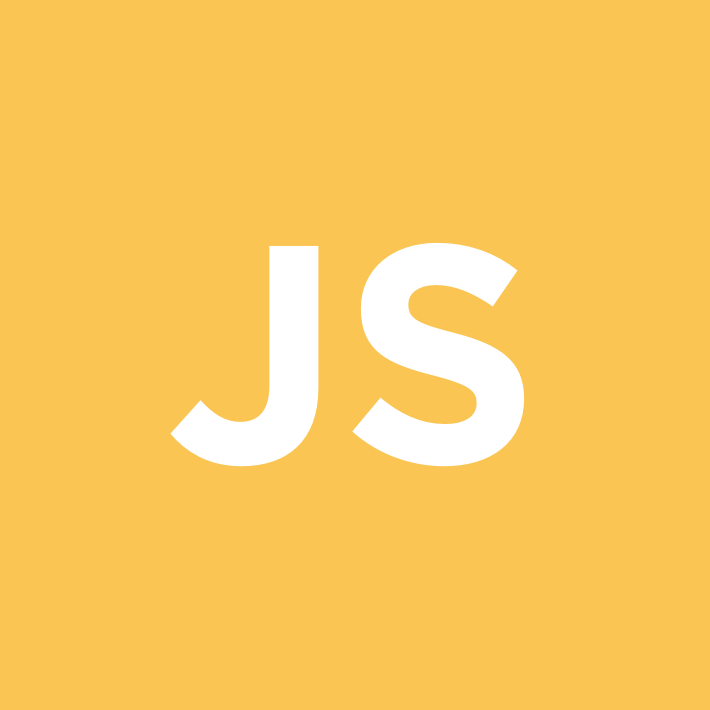

# JavaScript_All

자바스크립트의 기초부터 심화까지 모든 과정을 공부해보고 재 검토하기 위해 만든 레포입니다.

!제가 주관적으로 나누고 공부했습니다. 단계가 꼭 이렇지 않습니다.!

## 기초

---

- [자바스크립트란?](https://github.com/junu126/JavaScript_All/blob/master/Base-Class/What-Is-JavaScript.md)
- [자바스크립트의 작동 원리.](https://github.com/junu126/JavaScript_All/blob/master/Base-Class/How-Does-JavaScript-Work.md)
- [자바스크립트로 할 수 있는 것들.](https://github.com/junu126/JavaScript_All/blob/master/Base-Class/What-Can-Do-JavaScript.md)
- [기초라고 생각되는 문법들](https://github.com/junu126/JavaScript_All/blob/master/Base-Class/Grammar/_JavaScript's-Grammer.md)
  - Semicolons - 세미콜론
  - Types - 자료형
  - References - 참조
  - Object - 객체
  - Constructor and Class - 생성자 및 클래스
  - Arrays - 배열
  - String - 문자열
  - Control Statement - 제어문
  - Loop Statement - 반복문
  - Function - 함수
  - Destructuring - 비 구조화
  - Modules - 모듈
  - Hoisting - 호이스팅
  - Compasion Operators - 비교 연산자
  - Try Catch - 예외처리
- [스타일 가이드라인 이란?](https://github.com/junu126/JavaScript_All/blob/master/Maintainable-JavaScript/Style-Guide-Line/WHY-StyleGuide.md)
- [프로그래밍 프랙티스](https://github.com/junu126/JavaScript_All/blob/master/Maintainable-JavaScript/Programming-Practice/WHAT-Is-Programming-Practice.md)
- [문법들의 스타일 가이드.](https://github.com/junu126/JavaScript_All/blob/master/Maintainable-JavaScript/Grammer-Style-Guide.md)

## 심화

---

- [ECMAscript(ES6)문법](https://github.com/junu126/JavaScript_All/blob/master/Hard-Class/ECMAScript-Grammar.md)
- 자바스크립트에서의 this
- 스코프(블럭) & 클로저
- [프로미스](https://github.com/junu126/JavaScript_All/blob/master/Hard-Class/Promise/Promise.md)
- 함수형 프로그래밍

## Update

---

~2018년 9월 16일

- 파일 생성

+2018년 9월 17일

- 기초 & 심화 쿼리큘럼 작성.
- 기초 - 문법들의 스타일 가이드 까지
- 심화 - 함수형 프로그래밍 까지
- 자바스크립트란? 작성완료.

+2018년 9월 19일

- 자바스크립트로 할 수 있는 것들. 작성완료.

+2018년 9월 20일

- 자바스크립트의 작동 원리. 작성완료.
- Grammar레포 생성.
- 메인 문법설명 파일 작성완료.
- 1_Semicolons 작성완료.
- 2_Types 작성완료.

+2018년 9월 21일

- 3_Reference 작성완료.

+2018년 9월 22일

- 4_Object 작성완료.
- 5_class 작성완료.

+2018년 9월 23일

- 6_Arrays 작성완료.
- 7_String 작성완료.

+2018년 9월 24일

- 8_Control Statement 작성완료.
- 9_Loop Statement 작성완료.
- 10_Function 작성완료.

+2018년 9월 25일

- 11_Destructuring 작성완료.
- 12_Module 작성완료.

+2018년 9월 26일

- 13_Hoisting 작성완료.

+2018년 9월 27일

- 14_Compasion Operators 작성완료.
- 15_Try Catch 작성완료.
- 기초 문법 작성완료.
- 스타일 가이드 작성시작.
- 심화 - ES6문법 업로드완료.

+2018년 9월 28일

- 자바스크립트 스타일 가이드 추가

+2018년 10월 22일

- 스타일 가이드 폴더 이동
- 스타일 가이드라인을 사용하는 이유 추가

+2018년 10월 23일

- 스타일 가이드라인 - 기본 포멧 추가
- 기본 포맷 LINK 등록

+2018년 10월 24일

- 스타일 가이드라인 폴더 추가
- 기본 포맷 폴더 이동
- 스타일 가이드라인 - 주석 추가
- LINK 등록

+2018년 10월 25일

- 스타일 가이드라인 - '주석' 작성 완료

+2018년 10월 26일

- 프로그래밍 프렉티스 폴더 추가
- 프로그래밍 프렉티스 파일 추가
- 프로그래밍 프렉티스 - UI레이어 느슨하게 연결 추가

+2018년 10월 27일

- 프로미스 추가

+2018년 10월 28일

- 프로미스 완성

+2018년 10월 29일

- 프로미스 링크 업로드

+2018년 11월 6일

- 프로그래밍 프렉티스 - 'UI레이어 느슨하게 연결' 완료
- 프로그래밍 프렉티스 - NULL 비교 금지 추가

+2018년 11월 7일

- 프로그래밍 프렉티스 - 'NULL 비교 금지' 완료

+2018년 11월 8일

- 프로그래밍 프렉티스 - 사용자 에러 던지기 추가

+2018년 11월 9일

- 프로그래밍 프렉티스 - '사용자 에러 던지기' 완료

+2018년 11월 10일

- 프로그래밍 프렉티스 - 브라우저 탐지 추가

+2018년 11월 11일

- 프로그래밍 프랙티스 - '브라우저 탐지' 완료
- 자동화 폴더 추가
- 자동화 파일 추가
- 자동화 - 파일과 디렉토리 구조 추가

+2018년 11월 13일

- 자동화 - '파일과 디렉토리 구조' 완료
- 자동화 - 최소화와 압축 추가

+2018년 11월 14일

- 자동화 - '최소화와 압축' 완료

+2018년 11월 15일

- 자동화 - 문서화 추가

+2018년 11월 16일

- 자동화 - '문서화' 완성
- 자동화 - 테스트 자동화 추가
- 자동화 - '테스트 자동화' 완성

+2018년 11월 22일

- 문법 - this 생성

+2018년 12월 31일

- 문법 - 'this' 완성

+2018년 1월 12일

- DOM - 폴더 생성 및 ReactSyntheticEvent 추가.
